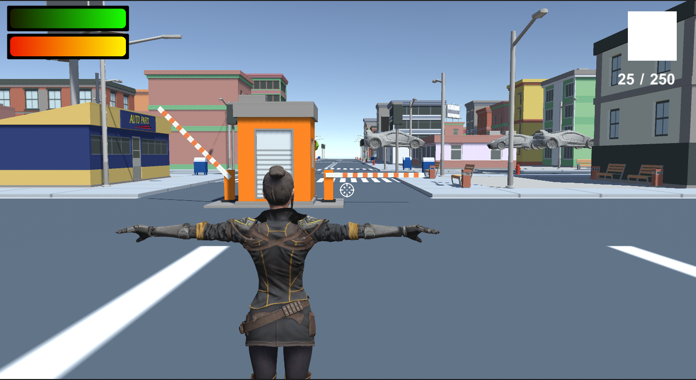

# **Práctica final**

Dejo [aquí](https://youtu.be/ievCpxTl_-w) el enlace al vídeo de demostración.

## **Cómo jugar**

 

El juego consta de tres escenas principales por las que navegar durante la partida: menú principal, nivel 1 y pantalla final. El juego está pensado para disponer de sólo un nivel, a modo de supervivencia. Tras terminar el juego, en la pantalla final, se muestra por pantalla el número de rondas que hemos aguantado.

- Menú principal: Consta de tres botones para iniciar la partida, configurar preferencias de volumen y salir de la aplicación. 

- Nivel 1: Correspondiente al primer nivel de juego. Aquí podemos controlar al jugador mediante las flechas del teclado o las teclas **A, S, D y W**. Se permite saltar pulsando la barra espaciadora, recargar el arma pulsando la tecla **R**. Movemos la cámara con el ratón y apretamos el botón derecho para disparar una vez o mantenemos pulsado para disparar continuamente. Se puede apuntar con precisión manteniendo pulsado el botón derecho del ratón.

- Game Over: Se muestra una vez superado el juego y dispone de un botón para volver al menú principal y un botón para cerrar la aplicación.

## **Refactoring**

 

La mayoría de los scripts de la práctica han sido reutilizados y mejorados en algunos aspectos para hacer del código algo mucho más modular y eficiente. El plan de trabajo durante el curso ha sido pulir al máximo todos los detalles, aunque no se hayan podido implementar ciertos aspectos en las prácticas. Así pues, la idea es tener un buen código que pueda servir para futuros trabajos sin necesidad de hacer muchos cambios.

> ### **Player scripts**
> Incorpora las funcionalidades correspondientes al sistema de estadísticas del jugador, la muestra por pantalla del HUD, el inventario y la gestión de sus objetos (así como el recogerlos), el cambio de armas y la gestión de los disparos.
>
> **1. Sistema de estadísticas:** Tanto para el jugador como para los enemigos, se ha creado una clase genérica llamada **Character Stats** de la cual heredan **Player Stats**, **Enemy Stats** y **Boss Stats**. Las tres clases son muy similares a las implementadas en la práctica anterior. En el caso del player, la única diferencia se encuentra en el método **EndGame()**, que se llama mediante Animation Events para finalizar el juego cuando termina la animación de muerte de nuestro personaje. 
>
> **2. Shooting:** Se ha simplificado mucho la clase de disparar asociada al jugador. Tal y como se comentó en el feedback de la PEC2, se ha desvinculado todo aquello relacionado con el arma. De esta forma, cada tipo de arma dispone de su propia función para usar o recargar munición, así como sus propios componentes. Esto nos permite inicializar el arma desde ese mismo script (más tarde veremos cómo) y usarlo en otras clases para acceder a sus variables.
>
>Así pues, la clase Shooting ha quedado reducida a los métodos **Shoot()** y **RaycastShoot()**. Para poder mantener la funcionalidad al completo, se accede a **WeaponClass** para extraer información sobre el arma que llevamos equipada en ese momento mediante el uso de prefabs.
> 
> El resto de métodos se conservan de versiones anteriores. Eso sí, el resto de clases asociadas al jugador también se ven afectadas por estos cambios.
> 
> **3. Inventory:** Siguiendo el mismo funcionamiento que en prácticas anteriores, podemos añadir elementos a nuestro inventario sin mayor problema. El cambio sustancial con esta clase se encuentra en el método **AddWeapon()**.
>
> Al desvincular el código de la clase shooting e instanciar un arma nueva (con sus respectivos valores de munición, sonidos, etc.), nos vemos obligados a inicializar el arma una vez la añadimos al inventario. Esto ocurre debido a la organización actual del código existente en la clase **Equipment Manager**. En el método **Start()** de dicha clase, añadimos al inventario un arma por defecto y, si no la inicializamos en ese momento perdemos el rastro de valores iniciales predeterminados para el arma. 
>
> Lo mismo ocurriría si intentamos recoger un arma del suelo y la añadimos al inventario. Cada vez que equipamos un arma nueva, al estar creando un nuevo prefab, debemos inicializar sus valores o de lo contrario nos encontramos con errores en tiempo de ejecución.
>
> **4. Equipment Manager:** Se recupera de la PEC2 la cración y destrucción de instancias para equipar y desequipar armas. Ahora se accede a la nueva clase creada para cada arma y se inicializan los valores de la UI mediante el acceso a la variable del prefab que se encuentra en este.
>

> ### **Enemy scripts**
> 
> Este apartado incluye información sobre la máquina de estados de los enemigos y su sistema de estadísiticas. Para ello, se ha hecho uso de la interfaz **IEnemyState**, ademas de los scripts correspondientes a cada uno de los estados y el manager, y de la herencia de **CharacterStats** para la implementación de **EnemyStats**. 
>
> - **EnemyStats**: Hereda de **CharacterStats** y sobrescribe un par de sus métodos: **CheckHealth** y **Die**. En el caso del primero, sencillamente actualiza la UI. Para el segundo, lanza un trigger de animación de muerte para el animator. Además, se encarga de de llamar a la función **DropLoot()** que forma parte de **LootableObj** y permitirá que suelten objetos con cierta probabilidad. Por último, destruye el objeto e instancia una explosión. También dispone de algunos métodos adicionales:
>
>
>   El script está prácticamente reutilizado con las añadiduras del animator. Además incluye el método **DestroyEnemy()** que se lanza desde un animation event para destruir el enemigo una vez se ha terminado la animación de muerte. También se hace referencia al script **ZombieSpawner** para llevar la cuenta de zombies eliminados.
>
> - **FSM:** Se ha eliminado el estado **AlertState** y se han implementado ciertos cambios en el wander y el attack.
>
>   1. `EnemyAI:` Se han añadido los métodos **OnAware** para settear el bool isAware a true cuando el zombie nos detecta y **StopScreaming** para determinar cuándo ha terminado la animación de gritar y puede pasar al estado perseguir.
>
>   2. `WanderState:` La funcionalidad del wander es exactamente la misma. La diferencia principal reside en la función **SearchForPlayer()**. Además de los triggers, el zombie dispone de un Field of View que veremos más adelante y que hace uso de Raycasting para detectar al jugador. Si esto ocurre, se llama a **OnAware()** y se lanza la animación del grito. Una vez terminada la animación, pasamos al estado de ataque.
>
>       El uso de **OnAware** y Animation Events ha permitido solventar el problema con la animación del grito planteado en la práctica anterior. Ahora el zombie sí espera a terminar el grito para empezar a perseguirnos.
>
>   3. `AttackState:` Estado al que se entra si el enemigo recibe un disparo o detecta al jugador tras el estado de wandering. Se ha modificado la forma de hacer daño de los enemigos. El lanzamiento de animaciones sigue siendo el mismo que en la práctica anterior. Sin embargo, para hacer el ataque esquivable, se ha añadido un collider en la mano del zombie que detecta cuando el jugador ha entrado para realizar el daño. Dicha mano tiene asociado el script **DealDamage** con un TriggerEnter que determina si debemos o no llamar a la funcion **DealDamage()** de **PlayerStats**.
>
>       

>       
>       

> ### **GameIssues**
>Este apartado incluye varios aspectos del juego que se han ido comentando por encima en el resto de apartados. Además, también contiene scripts de gestión de la partida como el **GameManager**. Vayamos primero a los scripts sueltos y, a posteriori, vemos el resto por apartados:
>
> - **Camera scripts** Se trata de dos scripts sencillos que gestionan el movimiento de cámaras y el crosshair de la escena.
>
>   1. `Crosshair Target:` Se ha añadido un layer para ignorar el collider de detección del zombie que causaba problemas en la práctica anterior. Para ello ha sido necesario especificar la distancia del rayo, que ha sido inicializada al infinito.

## **Añadidos**

 
A continuación se detallan los scripts añadidos a esta última práctica, más allá de los refactors realizados.

### **Player Scripts**

Al conjunto de scripts asociados al control de nuestro personaje se le ha añadido uno nuevo relacionado con el control de vehículos. Dicho script contiene información relevante para entrar y salir de los vehiculos durante la partida.

Para ello, se han inicializado las referencias correspondientes a los scripts a activar y desactivar tanto del player como del vehiculo. Para poder entrar y salir de estos, se hace uso de las teclas **E** y **F**.

Si pulsamos la tecla **E** se llama al método **GetIntoCar()** mientras que si pulsamos la **F** se llama a **GetOutOfCar()**:

- **GetIntoCar:** Activa los controles del coche y desactiva la inteligencia artifical asociada a este. Desactiva al jugador en tercera persona y cambia la cámara activa en escena.

>       void GetIntoCar()
>       {
>           // Enable driving
>           carController.enabled = true;
>           carUserControl.enabled = true;
>
>           // Disable IA
>           navigationController.enabled = false;
>           carWaypointNavigator.enabled = false;
>           smartDetection.enabled = false;
>           navMeshAgent.enabled = false;
>
>           // Disable player
>           player.transform.parent = this.gameObject.transform;
>           player.SetActive(false);
>
>           // Swap cameras
>           playerCams.SetActive(false);
>           carCam.SetActive(true);
>       }

- **GetOutOfCar:** Realiza justo lo contrario. Deshabilita la conducción del coche y habilita la IA. Habilita de nuevo al jugador en tercera persona y cambia la cámara activa.

>       void GetOutOfCar()
>       {
>           // Disable driving
>           carController.enabled = false;
>           carUserControl.enabled = false;
>
>           // Enable IA
>           navigationController.enabled = true;
>           carWaypointNavigator.enabled = true;
>           smartDetection.enabled = true;
>           navMeshAgent.enabled = true;
>
>           // Enable player
>           player.transform.parent = null;
>           player.SetActive(true);
>
>           // Swap cameras
>           playerCams.SetActive(true);
>           carCam.SetActive(false);
>       }

### **Enemy Scripts**

Se han añadido dos scripts a la lista de los anteriores:

- **FOV:** Hace uso de OverlapSphere para detectar a los objetivos a una cierta distancia. Después, mediante el uso de Raycasting y el ángulo de visión especificado, pone a true el bool detected. Dicho bool nos servirá en la máquina de estados para cambiar de estado una vez el zombie nos detecta.

- **ZombieSpawner:** Se han distribuido por el mapa distintos puntos de spawn para ubicar a los zombies. Se ha hecho así y no de forma aleatoria porque, en ciertas situaciones, los zombies se instanciaban dentro de edificios a los que es imposible acceder.

    Este script es el encargado de controlar las oleadas de zombies que determinan la puntuación final. Para ello, se han generado dos métodos:

    1. Start Wave: Inicializa la primera oleada. Se instancian 5 zombies nada más empezar el juego.

    2. Next Wave: Incrementa el número de oleada e instancia 5 zombies más a los que hubiera en la oleada anterior. Esto sólo ocurre si el número de enemigos derrotados es igual al número de enemigos instanciados.

### **Weapons**

Se ha creado el script **WeaponClass** que contiene las funciones asociadas anteriormente al script **Shooting**. Ahora se recarga y se usa munición desde el arma asociada. Esto hace el código mucho más modular y permite a cada arma tener su propia información sin depender del jugador. Además, se ha incluido la función **InitWeapon()** que se llama cada vez que se instancia un arma nueva en escena.

### **Audio y menús**

Se ha añadido un menú adicional al menú principal que nos permite configurar el volumen de la música y los efectos sonoros del juego. Para ello, se han implementado los siguientes scripts:

- **Profiles:** Permite crear scriptable objects con los diferentes controles de volumen. En nuestro caso se han creado 3: uno para el master volume, otro para la música y otro para los efectos. Contiene diferentes métodos usados para recoger información de los niveles de audio, settearlas y guardarlas. Para ello se hace uso de un audio mixer creado y que contiene los 3 canales de volumen principales del juego. 

    Para guardar la información se hace uso de PlayerPrefs. Mediante el bool saveInPlayerPrefs (que se settea mediante el botón apply de la interfaz), guardamos los valores de audio para nuestra partida actual y las próximas.

- **Sliders:** Script asociado a cada uno de los sliders que controlan los volúmenes de audio. Se encargan de settear los niveles de audio y de recoger los valores guardados en nuestras preferencias.

- **AudioController:** Encargado de aplicar o cancelar los cambios realizados en nuestra interfaz. Se usan los métodos ApplyChanges() y CancelChanges() que van asociados a cada uno de los botones pertinentes.

    

    
    

### **Traffic System**

Este apartado es probablemente el añadido más complejo realizado. Se ha creado una ventana de editor que permite crear Waypoint de forma ágil para implementar un sistema de tráfico que se usa tanto para peatones como para coches. Para poder hacer esto, se crea una carpeta Editor y se generan dos scripts:

- **Waypoint Editor:** Permite manipular los waypoints creados en la escena. Dibuja líneas que interconectan los waypoints en ambas direcciones (para saber cuál es el anterior y cuál el siguiente). Añade esferas que se pueden visualizar en la escena para hacer más cómoda la manipulación. 

    

    
    

- **WaypointManagerWindow:** Contiene los métodos necesarios para crear la ventana de editor y la funcionalidad de sus botones:

    1. **Create Waypoint:** Crea un objeto en la escena como hijo del parent seleccionado. 

    2. **Create Waypoint Before:** Crea un nuevo waypoint después del waypoint seleccionado.

    3. **Create Waypoint After:** Crea un nuevo waypoint antes del waypoint seleccionado.

    4. **Remove Waypoint:** Elimina el waypoint seleccionado.

    5. **Create Branch:** Crea una rama que permite desviar a un agente de un círculo cerrado de waypoints para dirigirse a otro. Esto permite generar más sensación de aleatoriedad, no sólo peatones o coches caminando en círculos.

- **Waypoint:** Script asociado a cada uno de los waypoints que vamos creando mediante la ventana de editor. Contiene información sobre el waypoint anterior y el siguiente, el ancho del camino y el branchRatio,que determina con qué probabilidad nos salimos del camino. Dicho script contiene un método que nos devuelve la posición en el espacio del waypoint dentro de unos márgenes determinados por el width. 

- **Waypoint Navigator y Car Waypoint Navigator:** Encargados de seleccionar el siguiente destino una vez hemos llegado al actual. Para ello llama a la función **SetDestination()** de la clase **Navigation Controller**. 
    
    La diferencia entre un script y otro es el uso de la dirección para determinar hacia dónde se mueve el agente. En el caso de los peatones, para generar más aleatoriedad, se permite que los agentes puedan moverse de inicio en la dirección opuesta a la preestablecida. De esta manera, los siguientes waypoints serán los anteriores. En el caso de los coches, como la carretera sólo puede ir en una dirección, se ha eliminado el componente asociado a la dirección.

    

    
    

- **Smart Detection y Run Over:** Estos dos scripts están asociados a los coches. Se usan dos colliders para detectar lo siguiente:

    1. Cuando el coche se encuentra circulando sólo, se usa Smart Detection para evitar que atropellen peatones o colisionen por detrás contra otro coche.

    2. Cuando circulamos con el coche, se usa Run Over para destruir a los peatones o los zombies contra los que chocamos.

- **Citizen Spawner:** Instancia un número determinado de peatones como hijos de un parent creado manualmente. 
